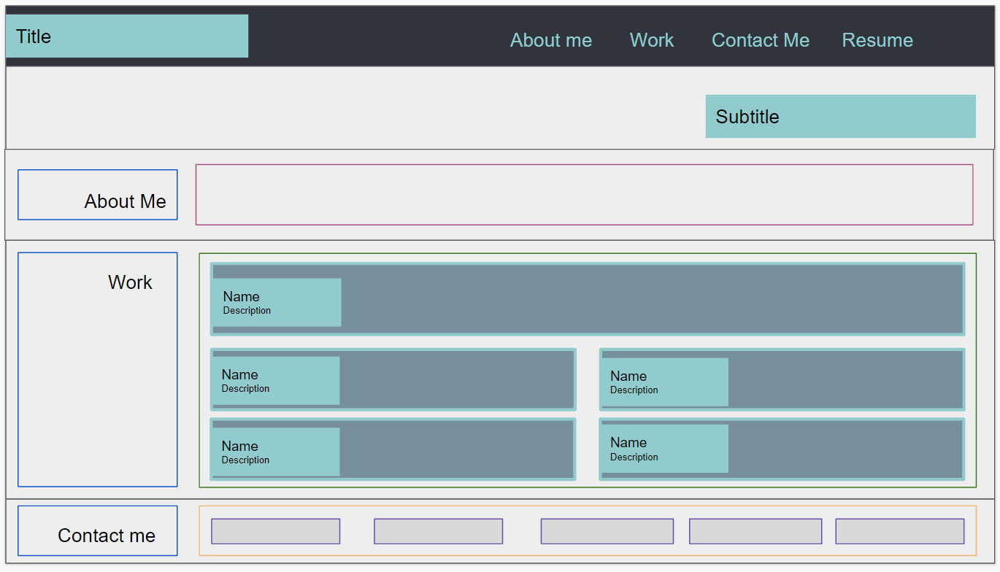

# Olga Gavrushenko: professional portfolio
## Description
Portfolio site is a showcase of web development work. Current site include links to the projects that show the the skills and proficiency in the next technologies
- HTML
- CSS
- JavaScript
- TBU .. frameworks

## Usage
This site was built using [GitHub Pages](https://pages.github.com/). 

Available by link https://olgagav.github.io/portfolio/

**About Me** section provide brief summary of professional path. 

**Work** section: you can find link to the implemented projects with references what technologies and frameworks were used. 

_Note:_ Work on some projects in progress. Links will be updated when ready.

**Contact Me** has the information how to contact me. Also link to 'Resume' is available at the top, in navigation menu.

Link to github repository: https://github.com/OlgaGav/portfolio

Site is made up using the mockup

Based on the mockup I created wireframe which used in development.

## Credits
Learning materials [Berkley Extension: coding bootcamp](https://extension.berkeley.edu/)

## License
n/a 
